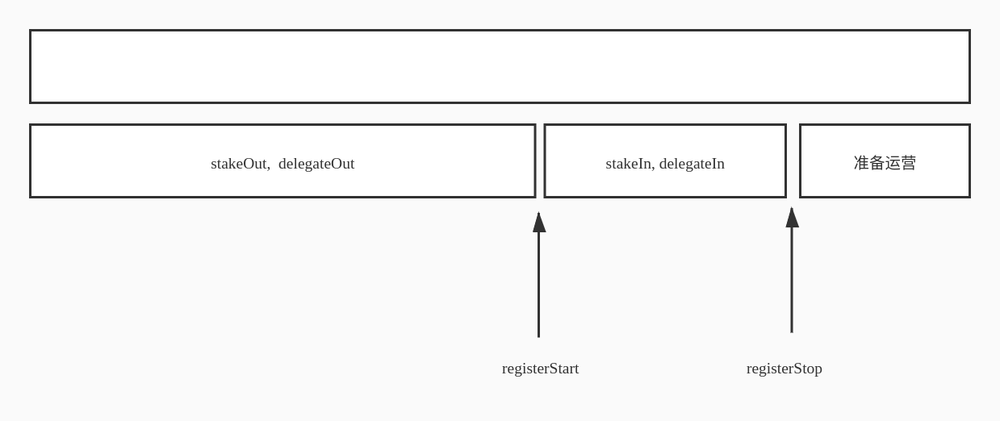

# Openstoreman需求分析文档 

|date      |revise             |  
|----      |----               |  
|2020-3-2  |initial version    |  
|2020-3-23 | 更新合约接口附录疑问 |  
|2020-3-31 | 更新注册接口        |

## 一 简介 

openstoreman是storeman开放的实现方案.  在现存的storeman方案中, storeman不能开放或者只能开放很少的几个, 不然会导致安全性和可用性问题.  

openstoreman主要做了签名方案的替换, 用schnorr签名替换了ECDSA签名.  schnorr签名已经在EOS跨链中实现了. 但是在openstoreman中, 需要支持激励和惩罚,需要对现有的schnorr算法做一些增强. 

另外,openstoreman需要用户注资,包括delegateIn功能, 这些通过标准的solidity合约实现.  

 

## 二 项目需求 

项目需要实现如下需求.  

* storeman合约逻辑的编写.  
涉及storeman注册，选择，storeman group更新，押金的管理等等逻辑 

* 惩罚机制   
要把以前的schnorr签名机制加点东西进去，使得中间互相发送的数据正确性能够得到验证(zhaoxiaofeng) 

* 普通storeman节点的delegateIn.
 

## 三 storeman合约和delegate 

正常运行情况下, 每一个storemanGroup支持一条主链, 原生Token和合约token同时支持. 而且支持自动发现新支持的token, openstoreman的agent不需要做任何修改, 也不需要重启即可支持新增一种token.

token的Wancoin的汇率是动态的, 放到一个oracle合约里(可以由基金会维护,手动更新), 整个group的额度也是动态的, 所有的token共享wancoin保证金的额度. HTLC交易发起前,根据汇率动态计算剩余的wancoin保证金额度是否足以支撑这笔HTLC交易.   

需要支持多个storemanGroup.  
基金会控制发起storemanGroup的注册. 当基金会认为需要发起一轮新的storemanGroup注册时, 发送一条交易(registerStart). 这条交易可以指定内定的节点的数量和enodeId等信息. 参与人通过stakeIn,提供自己节点的enodeId,pk, 同时打钱. 如果以前的storemanGroup没人退出, 则storemanGroup数量多一组. 如果有人退出, 则相应的那组storemanGroup解散, 在settleUp交易中完成退款和奖励惩罚的结算,然后由相关人自己claim提取收益.而不退出的那些人, 自动进入新的备选组参与竞选.    
当所有成员选择好以后, 所有的节点的enodeId就确定好了(此处EOS的mpc里需要修改, 去掉需要leader的IP要求)

storemanGroup组织好以后, Leader发起产生公共私钥的过程,生成共享私钥的过程链上完成. 成功后, 钱包就可以看到这个storemanGroup了.





###  基金会发起资金募集,开始组建storemanGroup  
 接口名: registerStart:  
 作用  : 开放一个storemanGroup的注册窗口, 允许注册(stakeIn,  delegateIn)  
 需要指定如下参数:
    - groupId: group的编号.   
    - wkAddrs:   白名单定节点的enodeId数组,白名单包含内定和备选两类  
    - senders:   白名单对应的钱包地址, 只有从这个地址注册才能认领白订单的enodeID.
    - workStart: 起始工作时间. 从1970年开始的秒数.
    - workDuration: storeman工作时长(天)  
    - registerDuration: 开放注册窗口的时间长度. (天)
    - chain: 工作的chain的名字.
    - minStake: 该group允许的最小投资额度.  
    - crossFee: 该group收取的跨链手续费.  
    - preGroupId: 上一个group编号. 如果指定了这个参数, 上一个group如果有人退出, 则没有退出的人, 自动进入当前group参与竞选.     
    
注意: 这个接口里只指定了白名单,但是并不打入资金. 

``` 
 function registerStart(bytes32 groupId, bytes chain, address[] wkAddrs, address[] senders, uint minStake,  
    uint workStart, uint workDuration, uint registerDuration, uint crossFee, bytes32 preGroupId)            
```


### 基金会向storeman管理合约注入资金
接口名: contribute  
作用:   基金会向storeman管理合约注入资金  
不需要参数.  
```$xslt
function contribute()
```

### 设置delegation资金与stake资金的比例. 
接口名: setDelegationRate  
作用:   修改最大delegation资金与stake自有资金的比值. 默认为10:1  
需要制定如下参数:  
    -rate:    修改最大delegation资金与stake自有资金的比值
```
function setDelegationRate(uint rate)
```    

### 注资参与独立节点竞选  
接口名:  stakeIn  
作用  :  参与者通过这个接口加入openstoreman计划.同时打钱.
需要指定如下参数:
    - groupIndex: 要参加的group的index.
    - enodeID: 注册自己的enodeID.  
    - PK:      节点对应的mpc身份标志公钥, 不复用p2p层的标志.  
    - fee:     打算收取的delegateIn的手续费. 单位是万分之. 范围是 0 ~ 10000  
```
function stakeIn(uint groupIndex,bytes enodeID, bytes PK, uint fee)
```
资金默认自动续期, 不想续期的话, 在退出时间窗口, 发送stakeOut交易声明退出.

### 声明退出openstoreman
接口名:  stakeOut  
作用 :   声明退出openstoreman计划, 只能在特定的时间窗口执行  
需要指定如下参数:  
    - groupIndex: 指定要退出的group index  
    - enodeID:    指定自己的enodeID.  
```
function stakeOut(uint groupIndex, bytes enodeID)
```

### storeman任期结束后清算
接口名: settleUp  
作用:   清算, 生成每个参与者能拿到的资金(包括本金,奖励,惩罚等的总和),只是清算,并不实际发送,需要参与者自己通过claim接口自己提取收益.
storeman任期结束后计算退款和奖励.  
需要指定如下参数:  
    - groupIndex: 指定要清算的group index  
只能由合约owner或group Leader发起.
```
function settleUp(uint groupIndex)
```

### 结束注册窗口
接口名: registerStop  
作用:   结束注册窗口,生成被选中的注册者列表, 未选中的生成退款清单不退款,等待用户claim退款;  
需要指定如下参数:
    - groupIndex: 指定要结束的group index  
```
function registerStop(uint groupIndex)
```

### 参与代理
接口名: delegateIn  
作用:   参与代理到某个group中的某节点.  
委托资金:自有资金为10:1  
需要指定如下参数:  
    - groupIndex: 指定要参与的group index  
    //- enodeID:    指定要参与的group中的节点的标志
    - staker:     指定投给哪个staker的地址.  
```
function delegateIn(uint groupIndex, bytes enodeID)
```

### 退出代理
接口名: delegateOut  
作用: 退出代理.  
需要指定如下参数:  
    - groupIndex: 指定要退出的group index  
    - enodeID:    指定要退出的group中的节点的标志  
```
function delegateOut(uint groupIndex, bytes enodeID)
```

### 转移资金到另一个group
接口名: stakeTransfer  
作用:   当一个group的生命周期结束, 如果其中某些节点退出, 导致group必须解散. 那些不打算退出的节点可以在新的一期group开始后发送交易转移资金参与新的group组建.  
需要指定如下参数:  
    - groupIndex: 打算参与的group index  
    - enodeID: 注册自己的enodeID.  
    - PK:      节点对应的mpc身份标志公钥, 不复用p2p层的标志.  
    - fee:     打算收取的delegateIn的手续费. 单位是万分之. 范围是 0 ~ 10000  
    - oldGroupIndex: 原始资金所在的group index  
    - oldEnodeID: 原始资金绑定的enodeID  
```
function stakeTransfer(uint groupIndex,bytes enodeID, bytes PK, uint fee, 
    uint oldGroupIndex, bytes oldEnodeID)
```
资金默认自动续期, 不想续期的话, 在退出时间窗口, 发送stakeOut交易声明退出.

### 提取收益或退款
接口名: claim  
作用:   group工作周期结束后或者竞选节点失败后提取收益或本金.  
需要指定如下参数:  
    - groupIndex: 指定要提取的group index  
    - enodeID:    指定要提取的group中的节点的标志  

注意: 发起的地址必须是当初资金注入时的钱包地址.
```
function claim(uint groupIndex, bytes enodeID)
```
### 提取收益或退款
接口名: delegateClaim  
作用:   group工作周期结束后提取收益或本金.  
需要指定如下参数:
    - groupIndex: 指定要提取的group index  
    - enodeID:    指定要提取的group中的节点的标志  

注意: 发起的地址必须是当初资金注入时的钱包地址. 
```
function delegateClaim(uint groupIndex, bytes enodeID)
```

## 生成共享私钥的过程上链.
1. 对应的合约
2. 过程的发起放到storemanAgetn里面, 根据事件自动响应. 

## 奖励过程根据pos的收益动态计算.
 

## 五 奖惩机制(zhaoxiaofeng) 

1. 提供一个api接口输出工作记录. 
1. 在提交HTLC合约时同时提交工作记录给合约, 
正常情况下只需要提交没有工作的节点编号. 有人作恶是需要提交作恶的证据.
需要明确我们能支持哪些作恶? 


## 七项目依赖 

目前实现schnorr签名的只有EOS跨链项目, 所以需要基于EOS的框架体系. Release的时候替代EOS跨链项目 

 

## 八 客户端工具 

客户端工具需要 

1) 轻钱包 

2) 离线钱包 

3) 网页版.(类似wan涨跌Dapp) 

 

## 九  浏览器 

浏览器需要能显示参与storeman和delegateIn的信息, 类似POS部分.  

 
## 附录: 疑问

 已确定问题
1. 资金不复用pos部分, 但激励与pos收益率挂钩.
1. mpc收集签名的过程, 等待一段时间，等到leader收集所有的碎片，以前是等到17个就不等了。
1. storeman周期固定为90天. 
1. 需要支持自动续期.
1. 支持delegateIn
1. 支持多组相同功能的group同时存在. 
1. 记录最大惩罚次数, 达到后, 不再使用此节点的数据.
1. 工作记录和HTLC跨链一起提交. 
合约不限制提交资格, 但是算法保证只有Leader能提交数据.
如果有人作恶, 提交证据
如果没人做恶, 提交未发送数据的节点编号.
1. 不做侧链方案.
1. 白名单节点也需要注入保证金. 
1. leader不交付跨连权限的交易。Leader不发起平账交易, 怎么办?
方案: 忽略这个问题.Leader是基金会控制的, 不会不发起平账的.
1. 奖励的分配, 是合约自动处理的的   
Leader发送每一次联合签名的记录, 由合约计算奖励明细.  
在storeman工作期满, 发送结算交易,一次性发放. 如果storemanGroup需要解散, 则退回本金.
1. 生成密钥的过程在链上.
1. 代理资金也参与选择节点.


未确定问题.


1. 平账流程(资产和债务，怎么决定平账给谁的问题)
方案1:  
不做平账.   
转入的token是所有storeman共享的. 只要不超出自己的额度即可.
方案2:   
假定新的group肯定能接受上一个group的债务和资金, 需要人工保证.


1. 当跨链资产过大或者WAN币价下跌的时候，怎么调整收益系数让更多人抵押更多的WAN呢？可以计算出预期收益率吗？ 抵押率是预先设定的还是动态调整？

1. 目前计划基金会控制多少比例的节点？怎么评估locked account里的资产安全? 怎么告知跨链用户？

