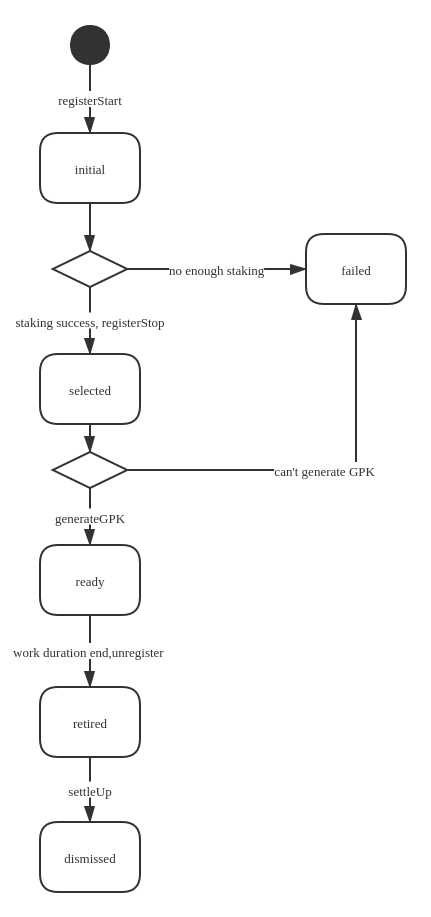

# StoremanGroupAdmin Design document

## storemanGroup 的状态
storemanGrup从创建到消亡, 存在这多个状态.   
* initial  
当基金会账号调用registerStart后, 合约内会创建一个storemanGroup, 状态为initial. 此状态下, 
group开始接受投注. 直到registerStart里指定的募资时间到期. 
* failed  
storemanGroup组建失败. storemanGroup组建过程中任意步骤出错导致不能完成, 都会进入这一状态. 
* selected  
募资周期到期后, 基金会应该发送registerStop结束募资,按照规则选出足够数量的开放节点,与白名单节点一起组成一个group.
group状态变成selected后, group内的节点应该开始发送交易生成gpk.

* ready  
group生成gpk后, 就可以为HTLC服务了. 但是要等到registerStart里指定的工作时间到达后才能真正接受HTLC交易.

* retired   
group到达registerStart指定的工作期限后, 不在接受HTLC交易. groupLeader发送平账交易, 然后leader发送unregister交易,
group进入retired状态.

* dismissed
进入retired后, leader或基金会发送settleUp交易清算奖励和惩罚.  group进入dismised状态, 用户通过claim, delegateClaim交易拿回自己的本金和利润.


## group状态转移



## storemanStake数据结构
```$xslt

    struct storemanDelegator {
        address sender; // the delegator wallet address
        address staker;
        bool  quited;
        uint    depositWeight;
        mapping(int=>uint) value;
    }
    struct storemanStaker {
        address sender;
        bytes enodeID;
        bytes PK;
        bool  quited;
        bool  selected;
        uint  delegateFee;
        uint    depositWeight;
        mapping(int=>uint) value;
        mapping(address=>storemanDelegator) delegators;
    }

    struct StoremanGroup {
        address delegate;                 /// the account for registering a storeman group which provides storeman group deposit
        //uint    deposit;                  /// the storeman group deposit in wan coins
        uint    depositWeight;
        uint    txFeeRatio;               /// the fee ratio required by storeman group
        uint    unregisterApplyTime;      /// the time point for storeman group applied unregistration
        mapping(address=>storemanStaker) stakers;
    }

    /// tokenOrigAddr->groupIndex->StoremanGroup)
    mapping(bytes => mapping(uint => StoremanGroup)) internal storemanGroupMap;

```


退出的流程.
1. 退出的时间.
一个group, 只允许在selected及只会的状态才可以退. 也就是说, 在选择前, 不允许退出.

2. delegator的退出.
2.1 没有被选中的节点的delegator的退出.
标志quited状态为true.  
sk的delegateDeposit减去相应的值.

2.2 选中的节点的delegator的退出
标志quited状态为true.
sk的delegateDeposit减去相应的值.


2.3 delegator的claim取出资产流程.
incentive设置为0
delegator从sk中删除. sk的delegatorCount减一
资金转入钱包账户中去.


钱包 对同一个group的同一个节点的投资合并在一起.
对同一个group同一个节点的代理合并在一起. 

claim取款的时间.
被选中者, 必须等group完成其工作才能取出来款. 而且需要提前发出退出指令. 
未被选中者, 可以直接取款, 不需要额外发退出.指令
sk的delegatorCount减一
